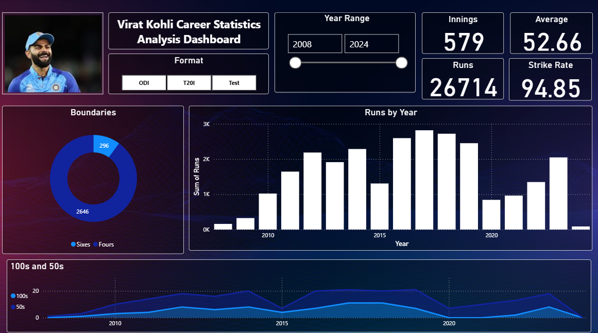

# Virat_Kohli_career_Dashboard

An interactive Power BI dashboard designed to explore and analyze Virat Kohli’s international cricket career through dynamic visuals, year-wise performance, format filters, and milestone tracking.

---

## 🚀 Project Purpose

This dashboard offers a complete statistical overview of Virat Kohli’s cricket journey from 2008 to 2024 across all formats—ODI, T20I, and Test. It helps fans, analysts, and cricket enthusiasts discover patterns and key milestones using dynamic filters and visuals.

---

## 🛠️ Tech Stack

The dashboard was built using the following tools and technologies:

- 📊 **Power BI Desktop** – For creating dynamic visuals and reports  
- ⚙️ **Power Query** – Data shaping and transformation  
- 🧠 **DAX** – Used to calculate career aggregates, trends, and slicer logic  
- 📈 **Interactive Charts** – Visual storytelling through bar, donut, and area charts  
- 🖼️ **.pbix + PNG** – Used for dashboard creation and snapshot preview

---

## 📂 Data Source

**Source**: [ESPN Cricinfo](https://www.espncricinfo.com/) and public cricket stats databases.

The dataset includes:
- Match-by-match performance stats
- Format-specific breakdown (ODI, T20I, Test)
- Year-wise aggregates of runs, innings, boundaries, strike rate, and averages
- 100s and 50s record

---

## 🔍 Features / Highlights

### 🧩 Business Problem

Cricket has millions of followers, but meaningful insights about a player’s career across time and formats often get lost in raw statistics. 

Questions like:
- How has Kohli performed year-over-year?
- How many boundaries or centuries has he hit?
- Which format suits him best?

...are not easily answered without data visualization.

---

### 🎯 Goal of the Dashboard

To build an intuitive, visual tool that:
- Tracks Kohli’s performance across formats and years
- Offers interactive filters for deep dive analysis
- Supports fans, analysts, and broadcasters with instant insights

---

### 📊 Dashboard Walkthrough

- **KPI Cards (Top Right)**  
  Total Innings: `579` | Runs: `26714` | Average: `52.66` | Strike Rate: `94.85`

- **Format & Year Filter (Top Center)**  
  Toggle between ODI, T20I, and Test formats, and select custom year ranges (2008–2024).

- **Boundaries (Donut Chart)**  
  Displays **2646 Fours** and **296 Sixes** across all formats.

- **Runs by Year (Bar Chart)**  
  Highlights year-wise run contributions and peak performance periods.

- **100s & 50s Trend (Area Chart)**  
  Progression of centuries and half-centuries over Kohli’s career.

---

### 📈 Business Impact

- 📌 **Cricket Analysts**: Identify high-performance years and format preference
- 📰 **Media & Broadcasters**: Use visual summaries for pre/post-match coverage
- 🎮 **Fans & Enthusiasts**: Engage with Kohli’s journey in a visual and interactive way
- 📉 **Data Storytellers**: Explore trends for sports analytics and presentations

---

## 🖼️ Screenshot

---

## 📎 Files Included

- `Virat_Kohli_Career_Dashboard.pbix` – Main dashboard file
- `Screenshot_of_Virat_Kohli_Career_Dashboard.png` – Visual preview of the dashboard

---

⭐ _If you liked this project, give it a ⭐ and share your feedback!_
